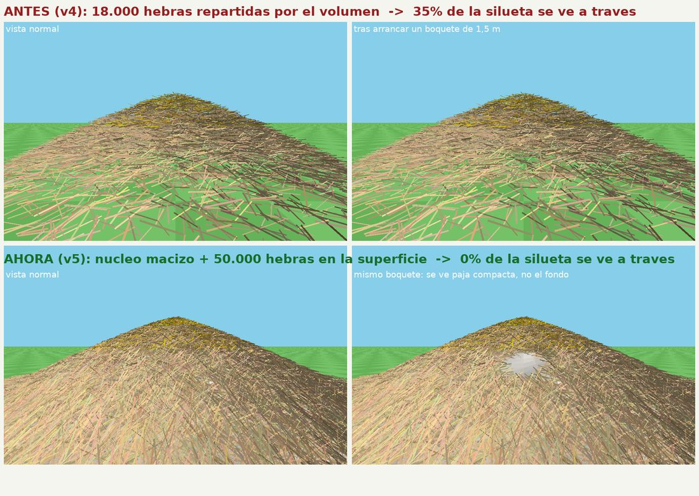

# Montón de Paja v5 — paja MACIZA: núcleo opaco + costra de hebras

El problema de la v4: las 18.000 hebras se repartían por el **volumen** del montón
(~231 m³) y sólo rellenaban el **1,5 %** de ese volumen. Resultado: se veía el cielo
y el suelo **a través de la paja**, porque entre hebra y hebra no había nada.
La paja real no se comporta así: un montón de paja es opaco.

La v5 cambia el enfoque. La paja no rellena un volumen: forma una **costra** sobre un
**núcleo macizo**.

*(Simulación offline del mismo algoritmo —no una captura de Godot— usada para medir el
"se ve a través": 35 % de la silueta del montón antes, 0 % ahora.)*

## Cómo se consigue que no se vea ni un hueco

1. **Núcleo macizo opaco** (`MoundCore`, un `ArrayMesh` generado por código):
   el mismo sólido de revolución del perfil `r(f) = base_radius·(1−f)^0.8`, hundido
   5 cm bajo la superficie, con relieve de ruido y una **textura de briznas
   procedural** (veteado + 2.600 fibras). Es opaco y más oscuro que las hebras, así
   que lo poco que asoma entre hebra y hebra se lee como **sombra de paja compacta**,
   nunca como un agujero.
2. **Todas las hebras en la superficie** (antes el 75 % estaban enterradas en el
   interior, donde no las ve nadie): viven en una capa de ~10 cm y van **tangentes al
   perfil**, como paja tumbada sobre el montón, con desorden de ±12°.
   Con 50.000 hebras son ~**250 hebras/m²** y la cobertura estimada del núcleo pasa
   del ~2 % al **~99 %** (se calcula y se imprime en el log al generar).
3. **Falda de hebras sueltas** (7 %) alrededor de la base, apoyadas en el suelo, para
   que no se vea la costura entre el montón y el césped.

## Lo que sigue igual

- `base_radius`: 7.5 m · `pile_height`: 3.4 m · perfil cóncavo → sólido **convexo** →
  un único `ConvexPolygonShape3D`: se **sube andando** (pendiente base ~29°, el
  jugador soporta 45°) y el clic recoge la hebra más cercana al impacto.
- **Toda la paja es cogible**: la falda y las hebras bajas de la ladera quedan fuera
  de la hitbox del montón, así que el suelo dentro de la zona de recogida
  (`suelo_click.gd`) reenvía el clic al montón, que recoge la hebra más cercana al
  impacto. La falda llega hasta `base_radius·1.18` (~8.85 m) más media hebra; la
  zona clickeable cubre hasta ~9.7 m alrededor del centro.
- `MultiMesh` por tier (3 draw calls), tiers común / seca / dorada, regeneración
  automática al vaciar el montón, y la punta sigue reservada para la **aguja** futura.

## Coste y cómo ajustarlo

| | v4 | v5 |
|---|---|---|
| Hebras | 18.000 | **50.000** |
| Triángulos | 432.000 (24 por hebra) | 600.000 (**12** por hebra: cilindro de 6 lados y **sin tapas**) |
| Draw calls | 3 | 3 + 1 (núcleo) |

Las hebras no proyectan sombra (ya era así); el núcleo sí, para que el montón se
asiente en el suelo.

- ¿Va justo de FPS? Baja `total_straws` a 30.000 (sigue siendo ~150 hebras/m² y
  ~96 % de cobertura: el núcleo opaco hace que bajar la densidad deje de ser
  catastrófico, sólo se ve algo más de paja compacta).
- ¿Sobra GPU? Súbelo a 80.000. El límite práctico es la memoria del
  `MultiMesh` (~64 bytes por hebra) y los triángulos, no el número de draw calls.
- `core_enabled = false` deja el montón como antes (sin núcleo) para comparar.

---

# (histórico) Montón de Paja v4 — "megamontón" caminable

Montículo procedural enorme con **18000 hebras cortas y HORIZONTALES** (cilindros finos) dibujadas con **MultiMesh** (un draw call por calidad). Un solo `PileCollision` (hull convexo) sirve para **subir andando** y para recoger: el clic elige la hebra más cercana al impacto.

- `total_straws`: 18000 · `base_radius`: 7.5 m · `pile_height`: 3.4 m
- Hebras cortas: 0.35–0.8 m, tumbadas casi horizontales (±14° del suelo)
- Perfil del montón: `r(f) = base_radius · (1−f)^0.8` → pendiente base ~29° (el jugador soporta 45°), **se sube andando**, y la punta queda afilada
- La punta es el sitio reservado para la **aguja** futura
- Tiers: común / seca / dorada (la dorada se concentra arriba)
- Regeneración automática al vaciar el montón

---

# Implementación de Pirámide de Paja Orgánica - Sistema de Recolección con Forma Natural

## Descripción General
Este sistema implementa una pirámide de paja interactiva en 3D con forma orgánica (cono/domo) y recolección por briznas individuales. Los jugadores pueden recolectar paja de la pirámide, la cual mostrará una forma natural que se reduce a medida que se recolecta.

## Archivos Creados

### 1. piramide_paja.gd
**Path:** `/Users/juanfran/pajar-incremental/piramide_paja.gd`

**Responsabilidades:**
- Gestión de la estructura de datos de briznas de paja
- Sistema de Tiers de paja (Común, Seca, Dorada)
- Generación procedural de malla con forma orgánica
- Eliminación de Z-fighting mediante diseño de malla sin caras solapadas
- Lógica de recolección con detección de briznas expuestas
- Animaciones y efectos visuales
- Regeneración automática de la pirámide
- Área de colisión amplia para mejor detección de clics

**Configuración Exportada:**
- `base_radius`: Radio base del montón (ej. 3.0)
- `height_levels`: Niveles de altura (ej. 5)
- `cell_density`: Densidad de briznas (ej. 0.8)

### 2. piramide_paja.tscn
**Path:** `/Users/juanfran/pajar-incremental/piramide_paja.tscn`

**Estructura de Nodos:**
- `PiramidePaja` (StaticBody3D)
  - `MeshInstance3D` (malla generada proceduralmente con forma orgánica)
  - `CollisionShape3D` (colisión para física)
  - `SelectionArea` (Area3D con esfera grande para mejor detección de clics)

### 3. Actualizaciones a jugador.gd
**Path:** `/Users/juanfran/pajar-incremental/jugador.gd`

**Nuevas Características:**
- Sistema de inventario por tipos de paja
- Funciones para gestionar paja de diferentes calidades
- UI actualizada para mostrar valor total de paja

### 4. Actualizaciones a vaca.gd
**Path:** `/Users/juanfran/pajar-incremental/vaca.gd`

**Compatibilidad:**
- Sistema de venta que considera tipos de paja
- Compatibilidad con sistema antiguo y nuevo

## Cómo Añadir la Pirámide al Editor de Godot

### Paso 1: Abrir el Proyecto
1. Abre Godot Engine 4.3
2. Carga el proyecto `PajarIncremental`
3. Abre la escena `main.tscn`

### Paso 2: Añadir la Pirámide a la Escena Principal
1. En la vista de escena (Scene tab), selecciona el nodo raíz `Main`
2. Arrastra el archivo `piramide_paja.tscn` desde el FileSystem dock hasta la vista de escena
3. La pirámide se agregará como hijo del nodo `Main`

### Paso 3: Posicionar la Pirámide
1. Selecciona el nodo `PiramidePaja` en la vista de escena
2. En el Inspector (Inspect tab):
   - **Transform:**
     - Posición: `0, 0.5, 0` (ajustar según sea necesario)
     - Rotación: `0, 0, 0`
     - Escala: `1, 1, 1`
   - **Script Parameters:**
     - `base_radius`: 3.0
     - `height_levels`: 5
     - `cell_density`: 0.8

### Paso 4: Configurar Propiedades de la Pirámide
1. Con el nodo `PiramidePaja` seleccionado:
   - **Properties:**
     - `base_radius`: Radio base (recomendado: 2.0-5.0)
     - `height_levels`: Niveles de altura (recomendado: 3-7)
     - `cell_density`: Densidad de briznas (recomendado: 0.5-1.2)

### Paso 5: Verificar la Conexión
1. Asegúrate de que el jugador pueda interactuar:
   - El sistema usa un área de colisión esférica grande para detección de clics
   - El jugador debe estar dentro del radio de la pirámide
2. Prueba haciendo clic en la pirámide con el mouse

## Sistema de Tiers de Paja

### Tres Niveles de Calidad:
1. **Tier 1: Paja Común**
   - Valor de venta: 1 oro
   - Color: Amarillo pálido (#f0d0a0)
   - Aparece en: Niveles inferiores/base

2. **Tier 2: Paja Seca**
   - Valor de venta: 2 oro
   - Color: Marrón claro (#c8a878)
   - Aparece en: Niveles medios

3. **Tier 3: Paja Dorada**
   - Valor de venta: 5 oro
   - Color: Dorado (#ffd700)
   - Aparece en: Niveles superiores/punta

## Mecánica de Forma Orgánica

### Sistema de Briznas Individuales:
- La pirámide tiene forma de cono/domo natural
- Cada brizna de paja es un cilindro delgado generado proceduralmente
- Las briznas tienen variaciones aleatorias para aspecto orgánico
- Al recolectar una brizna, se marca como vacía y se regenera la malla
- Esto crea un efecto de reducción gradual del montón

### Distribución Natural:
- Las briznas se distribuyen en patrones circulares con ruido
- El radio disminuye con la altura para forma cónica
- Mayor densidad en niveles bajos, menor en niveles altos
- Las briznas expuestas son las que están en la superficie visible

## Funcionalidades Avanzadas

### Regeneración Automática:
- Cuando todas las briznas están vacías
- La pirámide se regenera completamente
- Mantiene la configuración original

### Sistema de Inventario por Calidad:
- El jugador lleva registro por tipo de paja
- La vaca calcula el valor total basado en calidad
- UI muestra valor total, no solo cantidad

### Eliminación de Z-Fighting:
- Diseño de malla sin caras solapadas
- Cada brizna es independiente sin superposición de geometría
- Material optimizado para renderizado eficiente

### Área de Selección Mejorada:
- Uso de Area3D con forma esférica grande
- Mayor tolerancia para detección de clics
- No requiere apuntar exactamente al centro de una brizna

### Compatibilidad:
- Funciona con sistema de paja existente
- Compatible con escenas actuales
- No rompe funcionalidad existente

## Troubleshooting

### Problema: La pirámide no se muestra
- Verifica que el nodo MeshInstance3D tenga malla
- Revisa el código de regeneración de malla
- Comprueba que no haya errores en la consola

### Problema: No se puede recolectar paja
- Verifica que el área de selección esté configurada
- Asegúrate que el jugador esté cerca de la pirámide
- Comprueba que hay briznas expuestas disponibles

### Problema: `Error en (327, 35): Function "get_column()" not found in base Basis`
- `Basis.get_column()` / `get_row()` / `set_column()` existen **solo en C++**; no están expuestos a GDScript en ninguna versión de Godot 4 (comprobado contra `doc/classes/Basis.xml` de 4.0 → 4.7). Como `Basis` es un tipo *built-in*, el analizador lo convierte en **error de compilación**, no en aviso: el script entero deja de cargar.
- En GDScript las columnas de la matriz son las propiedades `basis.x`, `basis.y`, `basis.z` (columna 0, 1 y 2). Equivalente a `basis * Vector3(1,0,0)`, `basis * Vector3.UP`, etc. El constructor `Transform3D(x_axis, y_axis, z_axis, origin)` recibe esas mismas columnas.
- En este proyecto afectaba a `_straw_transform()` (escalado local de la hebra) y a `_verify_straws_are_horizontal()` (anti-regresión de hebras verticales). Ya corregido.
- Ojo con el mismo tipo de error en `asinf()`: **no existe**. La función global es `asin()`. Los sufijos `f` solo existen en `absf, ceilf, clampf, floorf, is_finite, lerpf, maxf, minf, randf, roundf, signf, snappedf, wrapf`.
- Sobre **clases nativas** (`Node`, `MultiMesh`, …) llamar a un método inexistente solo genera el aviso `UNSAFE_METHOD_ACCESS`; sobre built-ins y sobre `self` es error duro. Por eso este fallo bloqueaba todo el proyecto.

### Problema: Texto flotante no aparece
- Verifica el código de crear_texto_flotante
- Asegúrate de que el Label3D se añada a la escena correcta
- Revisa las posiciones de los textos

## Optimizaciones Futuras

### Mejoras Posibles:
1. Sistema de raycasting para selección precisa de briznas
2. Transiciones suaves para deformación de malla
3. Sistema de respawn programado de pirámide
4. Más niveles de calidad de paja
5. Efectos de partículas para recolección
6. Mejora en la generación de forma orgánica con ruido Perlin

### Performance:
- Malla procedural optimizada
- Solo se regenera cuando se modifican datos
- Sistema de pooling para textos flotantes

## Conclusión

El sistema de pirámide de paja orgánica agrega profundidad al juego con:
- Mecánica de recolección estratégica
- Sistema de calidad de recursos
- Forma natural y visualmente atractiva
- Eliminación de problemas técnicos como Z-fighting
- Área de interacción mejorada para mejor experiencia
- Compatibilidad con sistemas existentes

Para probarlo, simplemente añade la escena `piramide_paja.tscn` a tu escena principal y posiciona la pirámide donde desees que aparezca en el mundo.